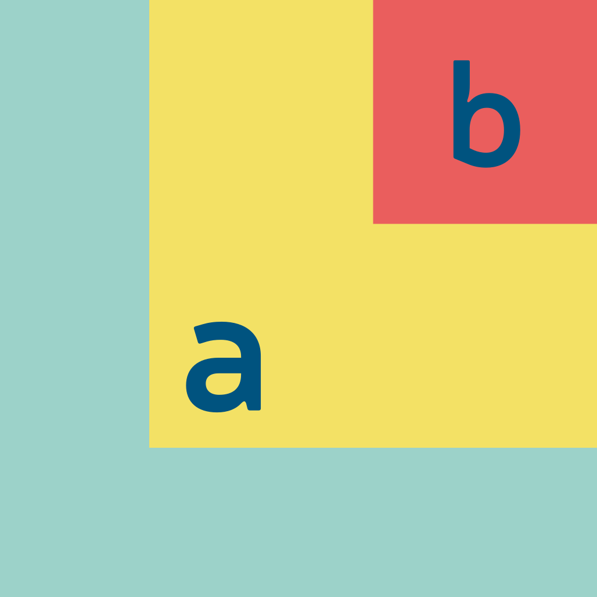
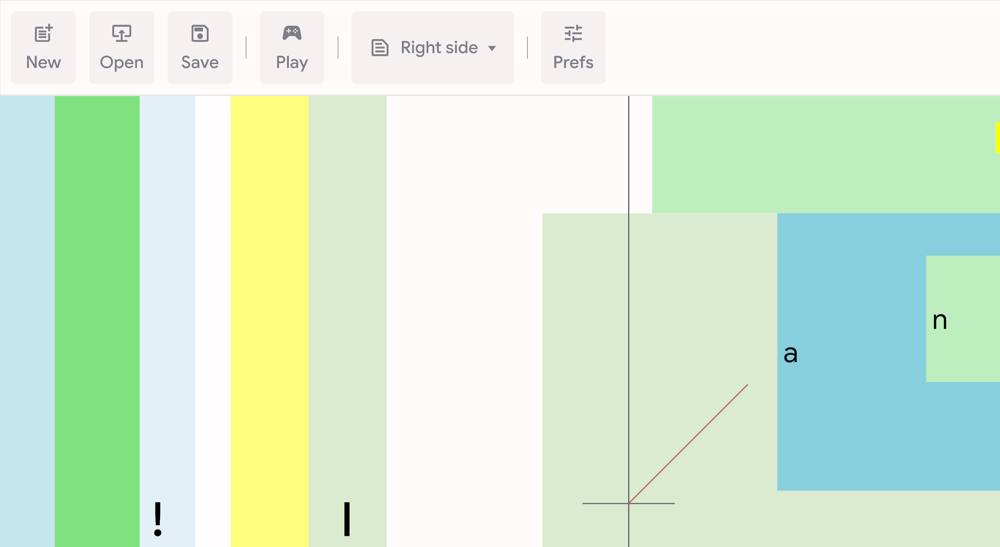
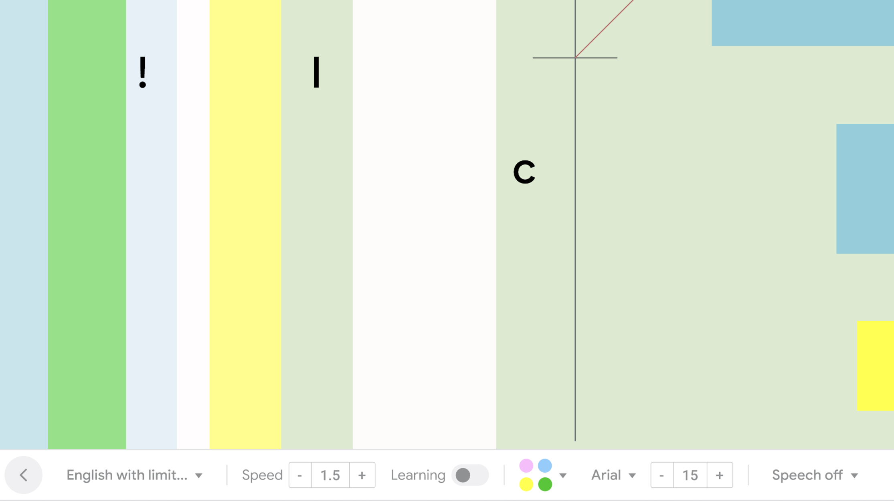
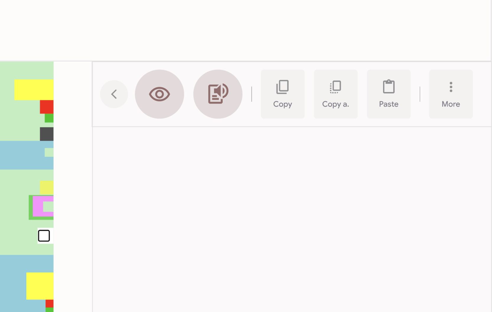
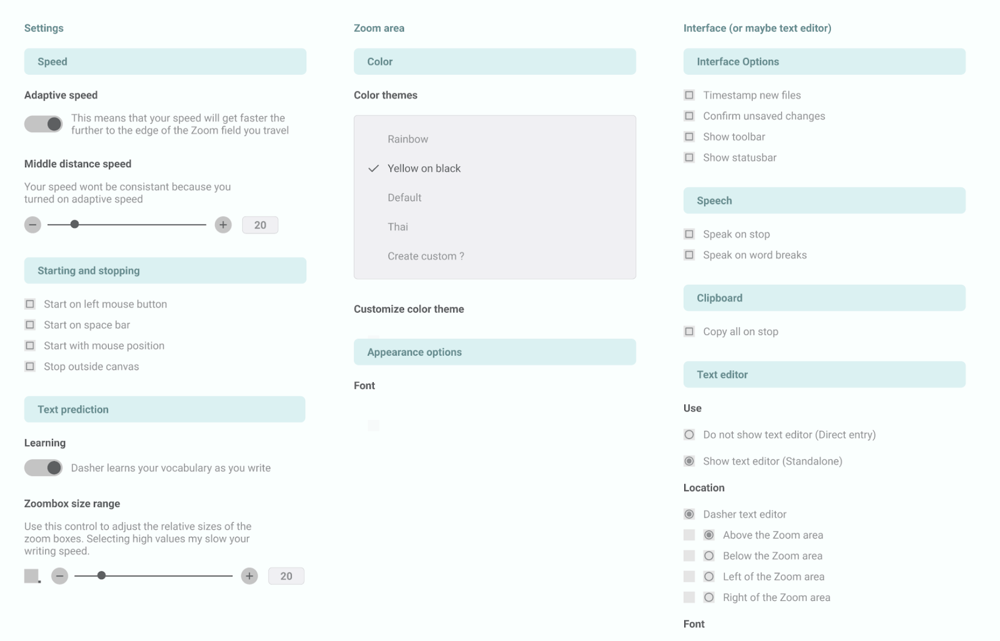
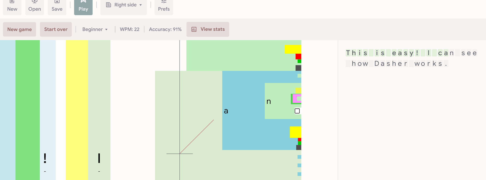
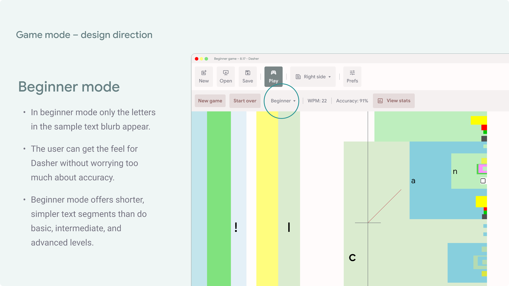

<p align="center">
  
</p>

<h1 align="center">Dasher v6.0 Design Guidelines</h1>

<p align="center"><strong>Official Styling, UI Framework, and Interaction Specification</strong></p>

---

## About This Repository

This is the **living design guide** for Dasher v6.0. It contains two documents:

- **README.md** (this file) — Human-readable design guidelines, rationale, and interaction specifications. Start here.
- **[DESIGN.md](DESIGN.md)** — Machine-readable design tokens following the [Google DESIGN.md spec](https://github.com/google/design.md). Use this for automated linting, cross-platform token validation, and as a single source of truth for coding agents.

### Keeping This Guide Up to Date

Design decisions evolve. When a change is agreed upon:

1. Update **DESIGN.md** tokens first (the normative source of truth for colors, typography, spacing, etc.).
2. Update this **README.md** to reflect the rationale and visual reference for that change.
3. Validate with `npx @google/design.md lint DESIGN.md` — zero errors before committing.

Platform-specific deviations (see below) should be documented in each platform's repository, not here. This guide stays canonical.

### Cross-Platform Architecture

Dasher v6.0 is not a single-platform app. Multiple native frontends connect to a shared **DasherCore** backend:

| Platform | UI Framework | Notes |
| :--- | :--- | :--- |
| **Web / Electron** | CSS / Tailwind | Reference implementation. See Section 9 for CSS variables. |
| **macOS / iOS** | SwiftUI | Map design tokens to Swift Color/Font extensions. |
| **Windows / Linux desktop** | Avalonia (XAML) | Use `SolidColorBrush` resources mapped to hex tokens. |
| **Linux (GNOME)** | GTK | Use CSS theming or `Gtk.CssProvider` with token values. |

Platform-specific adaptations are expected and allowed — a SwiftUI `Toggle` or a GTK `Switch` will not look identical, and that is fine. What must remain consistent across all platforms are the **color values, typographic scale, spacing, touch-target sizes, and interaction patterns** defined in this guide and codified in DESIGN.md.

---

## 1. Introduction & Product Vision

Dasher is a predictive, continuous-gesture text-entry system driven by zooming mechanics. Originally built as an accessibility aid for users with severe motor restrictions (utilizing eye-gaze, head-trackers, sip-and-puff devices, or joysticks), **Dasher v6.0** represents a complete cross-platform modernization.

Our core vision is to build an interface that feels **connected to conventional tech** while minimizing cognitive overhead, reducing "peripheral vision chaos," and lowering the onboarding steepness.

### Core Design Principles

- **Accessibility First:** Interfaces must support eye-tracking and single-pointer control with generous target sizes.
- **Reduced Visual Load:** Mute non-active elements and hide irrelevant branches to limit "sea sickness" effects.
- **Empathetic Onboarding:** Hand-hold beginners using interactive gamified training with contextual helpers.
- **Frictionless Wayfinding:** Ensure settings are easily searchable, previewable in real time, and logically structured.

## 2. Brand Identity & Logo Specification

The Dasher v6 logo represents the foundational zooming mechanic of the software, showcasing parent and child character nodes expanding outwards. This logo is **fixed** and must not be altered, stretched, or recolored.

<p align="center">
  
</p>

### Logo Usage Guidelines

1. **Clear Space:** Maintain a minimum clear space surrounding the logo equal to 25% of the logo's total width.
2. **Minimum Size:** For digital screens, the icon must not be rendered below 32px wide to ensure glyph visibility ('a' and 'b').
3. **Backgrounds:** The logo should be placed on high-contrast backgrounds (preferably white, light grey, or deep navy). Avoid complex background patterns.

## 3. Core Color Palette

The brand color palette is directly extracted from the fixed logo, bringing a vibrant yet professional aesthetic. It includes custom adjustments for high contrast to meet WCAG AA and AAA accessibility standards.

### Brand Colors

| Color Role | Color Name | Hex Code | RGB | Usage |
| :--- | :--- | :--- | :--- | :--- |
| **Primary Trim** | Dasher Teal / Mint | `#99D4CD` | 153, 212, 205 | Canvas framing, branding accents, primary buttons. |
| **Active Field** | Warm Yellow | `#F8E063` | 248, 224, 99 | Zooming boxes, current letter groupings, interactive hover states. |
| **Alert / Target** | Coral Red | `#EB5B5C` | 235, 91, 92 | Target highlight boxes, path corrections, error strikes, delete states. |
| **Primary Glyphs** | Deep Navy | `#0F4B75` | 15, 75, 117 | High-contrast text glyphs, labels, top bar iconography. |

### Supporting UI Neutrals

| Role | Light Theme Hex | Dark Theme Hex | Usage |
| :--- | :--- | :--- | :--- |
| **Background** | `#F4F7F6` | `#12181B` | App layout background. |
| **Card / Surface** | `#FFFFFF` | `#1E262B` | Sidebars, textboxes, settings panels. |
| **Border / Divider** | `#E0E6E8` | `#2A353D` | Structural separations, input borders. |
| **Subtle Highlight** | `#E9F2F1` | `#1D2D35` | Secondary action highlights. |

## 4. Typography

Legibility is critical to reducing eye fatigue during continuous zooming. Typefaces must feature wide apertures, distinct letterforms (e.g., clear distinctions between I, l, and 1), and uniform vertical heights.

### Primary Interface Font: Google Sans / Inter

- **Use Cases:** Menus, status bars, taskbars, preferences, and onboarding prompts.
- **Scale:**
  - *Titles (Settings / Onboarding headings):* 24px, Medium/Semi-Bold
  - *Subheadings / Actionable Items:* 16px, Medium
  - *Body Text / Help Prompts:* 14px, Regular
  - *Caption / Sub-labels:* 12px, Light/Regular

### Canvas Glyph Font: Arial / Noto Sans

- **Use Cases:** Zooming boxes (letters on the interactive canvas).
- **Scale:** Dynamic (relative to node bounds), heavy weights preferred for high-speed tracking.
- **Design Rule:** Enable font smoothing and subpixel rendering to prevent text jitter during high-speed zooming.

## 5. UI Layout & Component Framework

All Dasher UI panels must follow modern **Material Design** conventions. Since pointer accuracy can vary with assistive equipment, all targets require generous touch-surfaces and hovering forgiveness.

### Interface Grid

The main application uses a 3-pane responsive layout:

1. **Top Toolbar (Fixed height: 64px):** Quick commands and status overview.
2. **Main Interactive Area (Fluid height):**
   - *Left Pane (Optional):* Zooming Canvas.
   - *Right Pane:* Standalone Text Editor Window.
3. **Bottom Status Bar (Fixed height: 48px):** Real-time adjustment controls.

### Assistive Device Click Targets

- **Touch Targets:** Minimum dimension of 48dp x 48dp for all buttons.
- **Hover Thresholds:** Interactive elements must have a configurable hover-activation delay (dwell clicking) between 200ms and 800ms.

## 6. Toolbar & Taskbar UX Specification

### A. Top Toolbar

Consolidates macro-actions into distinct iconography with explicit tooltips.



- **New** - Reset document.
- **Open** - Open text file.
- **Save** - Save current output.
- **Play / Pause** - Toggle zooming canvas loop.
- **Position** - Placement swap (moves canvas Left, Right, Top, or Bottom relative to text editor).
- **Prefs** - Opens preferences modal.

### B. Bottom Status Bar

Allows on-the-fly micro-adjustments without interrupting text-composition flow.



- **Alphabet Selection Dropdown:** Clean combobox displaying active alphabet. Avoids burying language-swap triggers.
- **Speed Control:** `- [1.5] +` (Uses coarse buttons alongside a precise slider to simplify speeds for eye trackers).
- **Learning Mode Toggle:** Switch (On / Off). Shows visual feedback when "Guest Mode" is paused so vocabulary models aren't corrupted by testing.
- **Color Palette Switcher:** Visual swatch circle toggles between Rainbow, Yellow on Black (high-contrast), or Custom.
- **Text Editor Font Control:** `- [15] +` font size controls to toggle small/large output.
- **Speech Output Control:** Dropdown to configure text-to-speech output immediately upon finishing segments.

### C. Sidebar Text Editor & Clipboard Panel

A sleek panel immediately to the right of the canvas provides direct manipulation actions:



- **Copy** - Copy selected text.
- **Copy All** - Copy all composed text.
- **Paste** - Insert clipboard content.
- **Quick Speak** - Prominent button to vocalize last composed paragraph.

## 7. Preferences & Settings Architecture

We have completely reorganized the confusing legacy Windows preferences tabs. Users are overwhelmed by options; therefore, settings must have contextual hand-holding.

### Clean Re-Categorization

The settings tab-structure is grouped by **usage context** rather than content:



1. **Customization:** Themes, editor font size, layout alignments, application styling (Standalone vs. Composition vs. Direct Entry).
2. **Punctuation:** Capitalization filters, basic punctuation, numeral inclusion.
3. **Volume:** Text-to-speech engine selection, system alert volume, typing confirmation ticks.
4. **Locks:** Cursor constraints, pausing thresholds, stop-on-canvas-exit toggle.
5. **Accessibility (Key Tab):** Input device profiles (Eye-tracker, Mouse, Joystick), zoom thresholds, hover adjustments.

### Contextual Help & Mode Wizard

When a user clicks on an input mode (e.g., *Click Mode* vs *Compass Mode*), the right-hand panel dynamically displays a visual guide.

### Live Preferences Preview (Feasibility & Design)

To prevent users from clicking "Apply," closing the dialog, testing on canvas, and opening settings again, **Dasher v6 must feature a live mini-canvas preview directly in the settings modal**.

- **Feasibility:** The Electron/Web-based rendering pipeline isolates the canvas instance. The settings window spawns a duplicate lightweight canvas with simulated input, reflecting changes to color, zoom box size, and text margins instantaneously.

## 8. Onboarding & Guided Training (Gamification)

The primary reason new users abandon Dasher is the initial learning curve, often described as "sea-sickness inducing." Dasher v6 implements a scaffolded onboarding flow.

**Onboarding Sequence:**
`[Welcome to Dasher] ──> [Input Device Handshake] ──> [First Zoom Challenge] ──> [Progress Dashboard]`

### Interaction Mechanics for Beginner Mode

To mitigate cognitive overload during first training sessions, use these custom canvas rendering rules:



1. **Sibling Box Suppression:** Sibling nodes to the active target character ("over the axis" boxes) are displayed, but their child and grandchild boxes are **strictly hidden**. The user only sees letters immediately relevant to their current spelling goal.
2. **Color Harmonization:** Group siblings within the active zoom sector by rendering them in matching, muted monochromatic hues (e.g., light-grey or pale-teal) to quickly signal structural grouping without visually screaming for attention.
3. **Dynamic Pink Path Correction:**
   - **Behavior:** The correction path must not snap onto the screen all at once. Instead, it dynamically draws an extension arrow flowing towards the correct letter sequentially.
   - **Approach Fade:** As the user's cursor approaches the correct path, the pink path dynamically fades in opacity and shrinks in width, disappearing entirely once the cursor is within 10px of target bounds.
   - **Auto-Slow Target:** If the pointer drifts far off the correct path towards high-probability mistake zones, the zooming speed automatically drops (reaching 0 speed at critical divergence points) to give users space to correct their trajectory calmly.

### Stats & Milestones

At the end of a training sequence, display a clean, high-affirmation progress sheet highlighting WPM achieved, accuracy scores, and custom unlock badges (e.g., "Smooth Steerer").



## 9. Code Implementation Guide (Web Reference)

The following CSS variables serve as a **reference implementation** for the Web/Electron frontend. Other platforms should map these same tokens to their native equivalents (SwiftUI `Color` extensions, Avalonia `SolidColorBrush` resources, GTK CSS, etc.).

```css
/* Dasher Design System CSS Variables */
:root {
  --dasher-teal: #99D4CD;
  --warm-yellow: #F8E063;
  --coral-red: #EB5B5C;
  --deep-navy: #0F4B75;

  --bg-light: #F4F7F6;
  --surface-light: #FFFFFF;
  --border-light: #E0E6E8;

  --bg-dark: #12181B;
  --surface-dark: #1E262B;
  --border-dark: #2A353D;

  --touch-target-min: 48px;
}

/* Base button styling ensuring high-contrast & focus indicators */
.dasher-btn-primary {
  background-color: var(--dasher-teal);
  color: var(--deep-navy);
  min-height: var(--touch-target-min);
  padding: 12px 24px;
  border-radius: 8px;
  font-weight: 500;
  border: 2px solid transparent;
  transition: all 0.2s cubic-bezier(0.4, 0, 0.2, 1);
}

.dasher-btn-primary:hover,
.dasher-btn-primary:focus-visible {
  outline: none;
  border-color: var(--deep-navy);
  box-shadow: 0 4px 12px rgba(15, 75, 117, 0.15);
}
```

---

For the machine-readable design token specification used by coding agents and linting tools, see [DESIGN.md](DESIGN.md). When in doubt, DESIGN.md tokens are the normative values — this README provides the human context for why those values exist.
